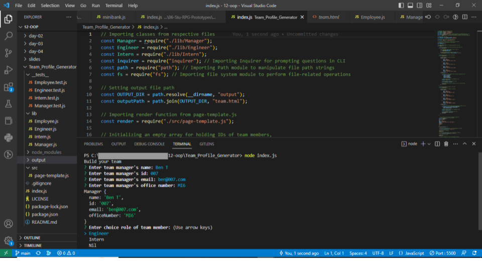
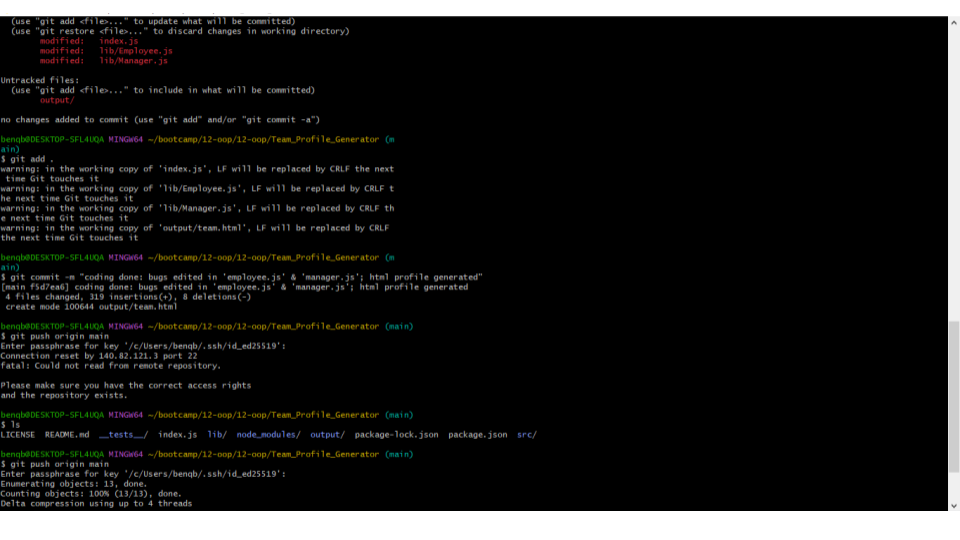

# Team Profile Generator
  

### Description


This application is based on Node.js command-line that allows the entry of information about software-engineer team members. It outputs a generated HTML webpage which displays details of each individual. Being object-oriented in design, Inquirer package for prompting user inputs and testing with Jest package are utilised.

### Table of Contents

* [Installation](#installation)

* [Usage](#usage)

* [License](#license)


* [Contributing](#contribution)

* [Test](#tests)

* [Questions](#questions)


## Installation

The dependencies required for running package installation are supported by these commands:

```
npm install inquirer@8.2.2 jest
```


## Usage

Runtime environment should be at least nodejs version 16.4

### Screenshots








## License

This project is under the MIT license.

## Contributing

Make branches and request for merge approval

## Tests

Run the following command for test on the installation:

```
npm run test

```

### Questions

For further inquiries contact me at bentork2020@gmail.com.
Find my past and current works here at [Btork2022](https://github.com/Btork2022).
